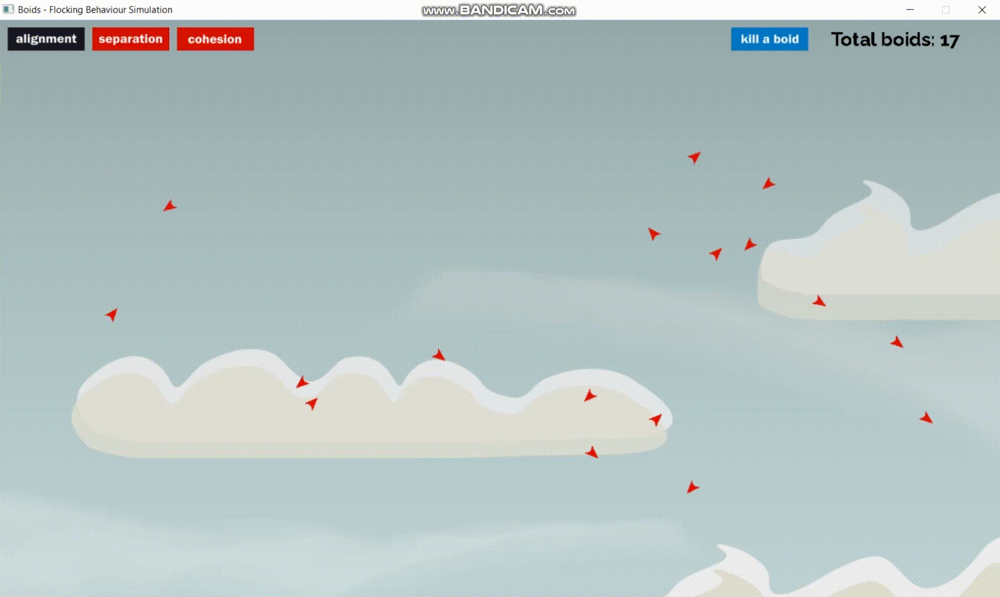

# Boids - Flocking Behaviour Simulation



## Introduction
An artifical life simulation originally developed by Craig Reynolds. The simulation aims to explain the behaviour of flocking birds. This simulation explains if how a single boid (bird) follows some certain rules, leads to a flocking behaviour among multiple boids.

Each boid follows three very simple rules:

1. **Seperation**: boids keep certain distance and move away from boids that get too close.
2. **Cohesion**: boids average the velocity of other boids in certain distance and try to match that velocity.
3. **Cohesion**: boids average the position of other boids in certain distance and move towards the center.

These three rules can be turned on or off during the simulation.

For implementation and other various details, see the [tutorial here](https://vanhunteradams.com/Boids/Boids.html)

Several factors effect how the rules are implemented to boids and how they behave such as:

- **Protected range**: boid moves away from other boids within this range
- **Visual range**: the range to which boids can see and align and move to the centre of mass
- **Margins**: the screen boundaries where boids take a turn when they start to get closer
- **Min speed**: guards the minimum speed of the boids
- **Max speed**: guards the maximum speed of the boids
- **Alignment factor**: the factor by which alignment occurs among boids
- **Cohesion factory**: the factory by which cohesion occurs among boids
- **Seperation factor**: the factor by which boids move away from other boids within **protected range**

All of these variables are in the ```constants.h``` header file and can be played around with by changing their values in the ```constants.h``` file.

## Compiling

### Windows

Uses ```MinGW 32 bit compiler``` which can be downloaded from [winlibs](https://winlibs.com/) - (Win32 UCRT Runtime). Add absolute path of mingw32/bin to path variables in environment variable.

Uses mingw 32 bit releases of [SDL2 2.26.3](https://github.com/libsdl-org/SDL/releases/tag/release-2.26.3), [SDL2_image 2.6.3](https://github.com/libsdl-org/SDL_image/releases/download/release-2.6.3/SDL2_image-devel-2.6.3-mingw.zip) and [SDL2_ttf 2.20.2](https://github.com/libsdl-org/SDL_ttf/releases/download/release-2.20.2/SDL2_ttf-devel-2.20.2-mingw.zip) which can be downloaded from the links given.

After downloading, create a ```libs``` directory in ```C:/``` and extract all of them to the directory.

Create a ```bin``` folder in root directory of project and add the ```DLLs``` for ```SDL2, SDL2_image, SDL2_ttf``` and copy the ```./res``` folder.

Finally compile and run by running the command:

```
make windows
```

The compiled binary is in the ```./bin``` folder. 

### Linux

Install the dev packages for ```SDL2, SDL2_image, SDL2_ttf``` for your distro and run the following command:

```
make linux
```

Copy the ```./res``` to ```./bin``` folder for the compiled binary to run.